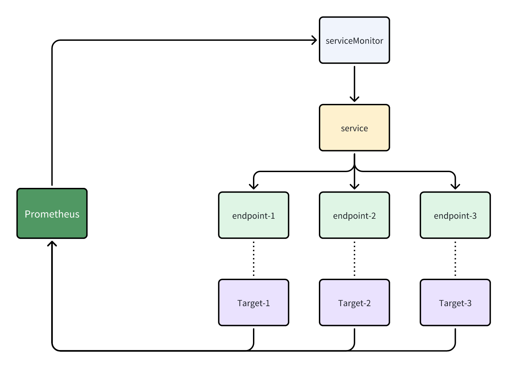

常见面试题汇总

Q: 集群内部署的 prometheus 是怎么发现对应的监控的服务,比如 node-exporter 的,并采集到对应每个node的监控？
A: 现在数据上云之后 prometheus 的服务发现一般都利用了 servicemonitor 来进行动态发现, ServiceMonitor 就会找到对应 Service 资源的
labels 选择器的 Endpoint 资源, 并且会被 Prometheus-Operator 自动配置为 Prometheus的targets
原理图如下
参考:https://www.cnblogs.com/maxzhang1985/p/17374615.html